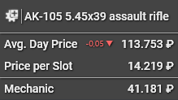
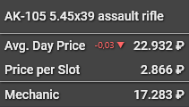

  

  

# Rat Scanner

Rat Scanner is a open source tool for [Escape from Tarkov][escape-from-tarkov].

Please consider [supporting](#Support-the-project) the project to help finance the backend server as well as the [API][tarkov-market].

 

## What it does

Rat Scanner allows you to scan items in the game and provides you with data about items (average price, value per slot, ...).

The information is taken from a [third-party API][tarkov-market] which takes the data directly from the game.

 

## How it works

The tool is entirely external. This means it is not accessing any memory of the game, like cheats do.

Instead, when you want to scan a item, a screenshot is taken and image processing is applied to identify the clicked item. The item is then looked up in the database and information is displayed in the window and with a overlayed tooltip.

 

## How to use

Your game has to be in either `Borderless` or `Windowed` mode for the overlay to work!

There are currently two types of item scan methods

### Name scanning

_Name scanning refers to scanning the inspection name of a item._

- Simply left click onto the magnifier icon inside the inspect window

Limitations

- Uses / durability is always assumed at 100%
- Weapons and other modable items will only show info of the base item

### Icon scanning

_Icon scanning refers to scanning the icon of a item._

- Hold the modifier key down while left clicking on a item
- The modifier key can be changed in the settings (default is `Shift`)

Limitations

- Uses / durability is always assumed at 100%
- Items which share a icon with other items (especially keys) will result in a uncertain match

Notes

- Check out the [indicator for modded items](#modded-item-indicator)
- If the item size does not get detected correctly, try to click in a corner of the item

 

## Modded Item Indicator
When attached mods on a item were detected, they will be included in the data.
This is indicated by an icon which is displayed to the left of the item name.

Price includes attached mods       | Price **does not** include attached mods
:--------------------------------: | :------------------------------------:
 | 

## Minimal UI
Switch to the minimal ui by clicking the dedicated button inside the titlebar.
Get back to the standard view by **double clicking** anywhere inside the window.

Background opacity as well as the data which is shown can be configured in the settings.

## Download

You can directly download the latest version [here][latest-release] or choose a specific version to download [here][releases].

After you downloaded the Zip-Archive (you only need `RatScanner.zip`) extract it anywhere on your PC and run `RatScanner.exe`.

Once it has launched, go into the settings menu (bottom right corner) and check that your resolution is set properly (default is FullHD).

**Important:** If the tool does not seem to start, make sure you have the [.Net Core Runtime][net-core-download] installed.

 

## Setting up the repository

1. Clone the repo
2. Copy the `name` folder and the `correlation.json` from the [EfT-Icons][eft-icons-repo] repository inside `RatScanner\Data\`

### Compiling

- Open the solution inside Visual Studio and click Build -> Build Solution

### Publishing

- Run the `publish.bat` script which is inside the repository root.
- The output will be located in a folder called `publish` on the same level as the publish script.

 

## Contributing

Please read `CONTRIBUTING.md` before contributing.

 

## Support the project

This will help to pay for the backend server as well as the [API][tarkov-market] which provides the backend with data.

[escape-from-tarkov]: https://www.escapefromtarkov.com/
[tarkov-market]: https://tarkov-market.com/
[eft-icons-repo]: https://github.com/Blightbuster/EfTIcons
[latest-release]: https://github.com/Blightbuster/RatScanner/releases/latest/download/RatScanner.zip
[releases]: https://github.com/Blightbuster/RatScanner/releases/
[net-core-download]: https://dotnet.microsoft.com/download/dotnet-core/current/runtime
