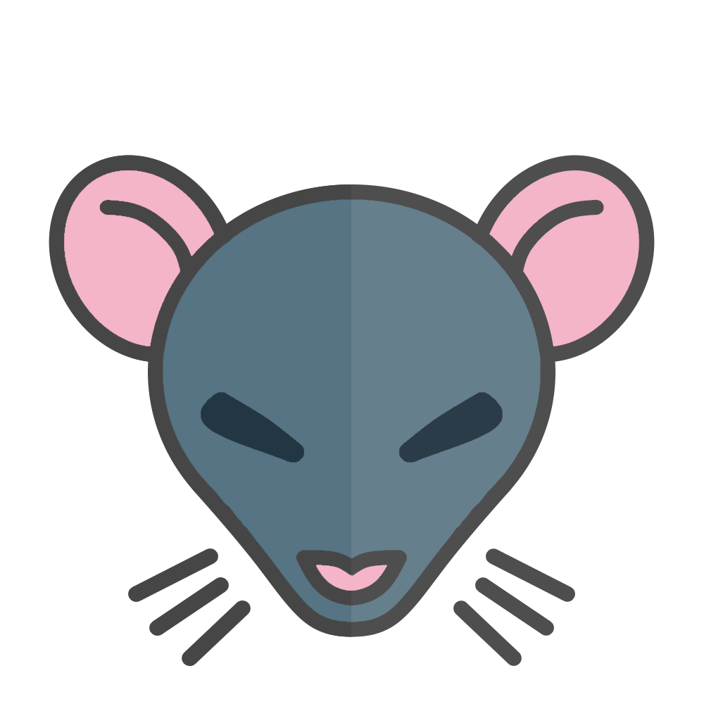
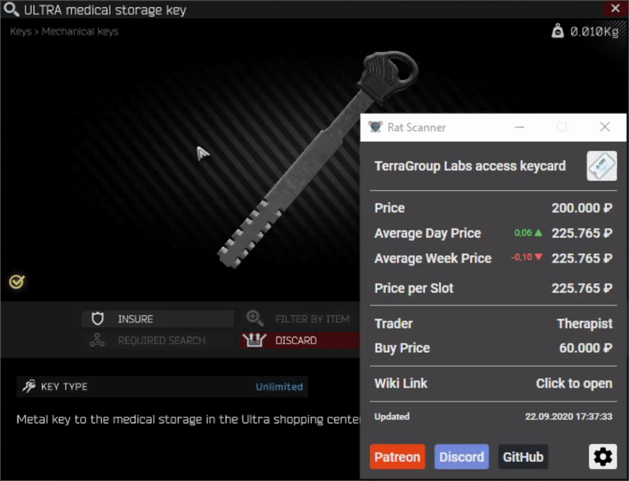
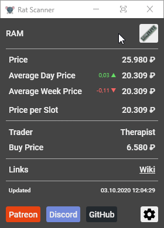

# Rat Scanner

Rat Scanner is a open source tool for [Escape from Tarkov][escape-from-tarkov].

Please consider [supporting](#Support-the-project) the project to help finance the backend server as well as the [API][tarkov-dev].

[Tutorial / Demo Video][demo-video] - [Frequently asked Questions][faq-page]

 

## Can I get banned for using Rat Scanner?

While Battlestate Games does not support nor is affiliated with this project, it exists since two years with over 1.000 players using it every day in their games. So far there has not been a single instance in which RatScanner was proven to have caused any ban.

 

## What it does

Rat Scanner allows you to scan items in the game and provides you with data about items (average price, value per slot, ...).

The information is taken from a [third-party API][tarkov-dev] which takes the data directly from the game.

 

## How it works

The tool is entirely external. This means it is not accessing any memory of the game, like cheats do.

Instead, when you want to scan a item, a screenshot is taken and image processing is applied to identify the clicked item. The item is then looked up in the database and information is displayed in the window and with a overlayed tooltip.

 

## How to use

Your game may need to be in either `Borderless` or `Windowed` mode for the overlay to work.

There are currently two types of item scan methods

### Name scanning

_Name scanning refers to scanning the inspection name of a item._

- Simply left click onto the magnifier icon inside the inspect window

Limitations

- Uses / durability is always assumed at 100%
- Weapons and other modable items will only show info of the base item

### Icon scanning

_Icon scanning refers to scanning the icon of a item._

- Hold the modifier key down while left clicking on a item
- The modifier key can be changed in the settings (default is `Shift`)

Limitations

- It is unfortunately no longer possible to scan weapons
- Uses / durability is always assumed at 100%
- Items which share a icon with other items (especially keys) will result in a uncertain match
- There will be missmatches when scanning icons in the top left of the item stash since the bright light (top center of the screen) interferes with it

 

## Minimal UI

Switch to the minimal ui by clicking the dedicated button inside the titlebar.
Get back to the standard view by **double clicking** anywhere inside the window.

Background opacity as well as the data which is shown can be configured in the settings.

## Download

You can directly download the latest version [here][latest-release] or choose a specific version to download [here][releases].

After you downloaded the Zip-Archive (you only need `RatScanner.zip`) extract it anywhere on your PC and run `RatScanner.exe`.

Once it has launched, go into the settings menu (bottom right corner) and check that your resolution is set properly (default is FullHD).

If you have any problems with the process please checkout the [FAQ][faq-page] or join the [Discord][discord] if you need further help.

**Important:** If the tool does not seem to start, here's some [common issues][common-issues]

 

## Setting up the repository for development

1. Clone the repository
2. Copy the `Data` folder from the latest release to `RatScanner\Data\`

### Compiling

- Open the solution inside Visual Studio and click Build -> Build Solution

### Publishing

- Run the `publish.bat` script which is inside the repository root.
- The output will be located in a folder called `publish` on the same level as the publish script.

 

## Contributing

Please read `CONTRIBUTING.md` before contributing.

 

## Support the project

This will help to finance the backend server as well as the [API][tarkov-dev] which provides the backend with data.

[escape-from-tarkov]: https://www.escapefromtarkov.com/
[tarkov-dev]: https://tarkov.dev/
[eft-icons-repo]: https://github.com/RatScanner/EfTIcons
[latest-release]: https://github.com/RatScanner/RatScanner/releases/latest/download/RatScanner.zip
[releases]: https://github.com/RatScanner/RatScanner/releases/
[demo-video]: https://www.youtube.com/watch?v=tXoIkgXFmdA
[faq-page]: FAQ.md
[faq-page-can-i-get-banned]: FAQ.md#can-i-get-banned-for-using-rat-scanner
[discord]: https://discord.com/invite/aHZf7aP
[common-issues]: https://github.com/RatScanner/RatScanner/blob/master/FAQ.md#program-issues-1
